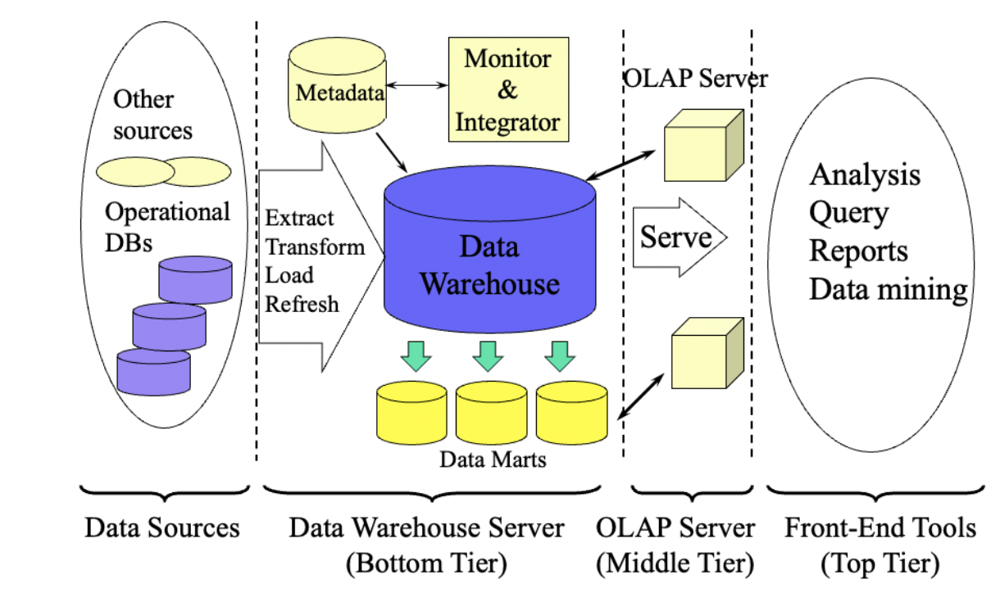

# ETL-OLAP-Algorithm

## Overview
A data warehouse is a subject-oriented, integrated, time-variant, and nonvolatile collection of data in support of management’s decision-making. The following figure illustrates the process of constructing and using a data warehouse.

## ETL Defination
The process of extracting data from source systems and bringing it into the data
warehouse is commonly called ETL, which stands for Extraction, Transformation, and Loading.
Note that ETL refers to a broad process, and not three well-defined steps. Normally, ETL includes extraction, cleaning, transformation, loading, and refreshing. Nevertheless, the entire process is known as ETL.

## OLAP Defination
Data warehouses provide online analytical processing (OLAP) tools for the interactive
analysis of multidimensional data of varied granularities, which facilitates effective data
generalization and data mining. Typical OLAP operations include roll up, drill down, slice, dice,
and pivot.

## Instructions to run on local computer

1) Create a folder and just add ETL_OLAP.java into that folder.
2) Keep the "Car_Sales_Data_Set.csv" outside of the folder.
3) Open the program and run it. (I have used IntelliJ Software)

## Sample Data Set

A sample data set file titled “Car_Sales_Data_Set.csv” is used as the original
data set for our data warehouse. Specifically:

a) CSV stands for Comma-Separated Values. A CSV file is a text file that uses a comma to
separate values. Often, the first record in a CSV file is a header line including a list of field
names. Therefore, it is very easy to dig into a CSV file and look for useful information. You
can use any text editor to open a CSV file and view its content. More details about CSV
can be found here: https://en.wikipedia.org/wiki/Comma-separated_values

b) The sample data set is provided with the code.

c) There are 64 records (not including the header line) in the data set.

d) The data set includes 5 fields: Country, Time_Year, Time_Quarter, Car_Manufacturer,
Sales_Units.

e) In this data warehouse, there are 3 dimensions (i.e. Country, Time, and Car_
Manufacturer) and 1 measure (i.e. Sales_Units). In addition, the dimension of Time is
associated with a two-level concept hierarchy: Time_Quarter < Time_Year. The valid
values for each of the dimensions are listed below:
a. Country: Canada, United States
b. Time_Year: 2017, 2018
c. Time_Quarter: 1, 2, 3, 4
d. Car_ Manufacturer: Toyota, Honda, Ford, BMW

## ETL Operations Performed by the Program

a) The first sorting deals with the field of “Country”. Once it is done, records associated with
Canada are in front of records associated with United States. Now we have two sequential
groups of records: Canada_Set and US_Set. Note that both groups are still in the same
CSV file.

b) The second sorting is based on the result of the first sorting. The second sorting deals with
the field of “Time_Year”. Once it is done, records associated with Canada are still in front
of records associated with United States; however, within the Canada_Set, records
associated with 2017 are in front of records associated with 2018 (this also applies the
US_Set). Now we have four sequential groups of records in the same CSV file:
Canada_2017_Set, Canada_2018_Set, US_2017_Set, US_2018_Set.

c) The third sorting is based on the result of the second sorting. The third sorting deals with
the field of “Time_Quarter” and it does not change the order of the data groups mentioned previously. However, within each data group (e.g. Canada_2017_Set), records are sorted according to the quarter values (in ascending order, i.e. 1, 2, 3, 4). Now we have
sixteen sequential groups of records: Canada_2017_1_Set, Canada_2017_2_Set, …,US_2018_3_ Set, US_2018_4_ Set.

For an n-dimensional data cube with each dimension being associated with Li levels, the number of available cuboids is:

The data warehouse in this project involves 3 dimensions (i.e. Country, Time, and Car_
Manufacturer). In addition, the dimension of Time is associated with a two-level concept hierarchy: Time_Quarter < Time_Year. Therefore, the number of cuboids is (1+1) x (2+1) x (1+1)= 12. Specifically, the cuboids correspond to the following tuples:
1. ()
2. (Country)
3. (Time_Year)
4. (Time_Quarter - Time_Year)
5. (Car_ Manufacturer)
6. (Country, Time_Year)
7. (Country, Time_Quarter - Time_Year)
8. (Country, Car_ Manufacturer)
9. (Time_Year, Car_ Manufacturer)
10. (Time_Quarter - Time_Year, Car_ Manufacturer)
11. (Country, Time_Year, Car_ Manufacturer)
12. (Country, Time_Quarter - Time_Year, Car_ Manufacturer)
Note that “Time_Quarter - Time_Year” means the combo of quarter and year. One example value
of this concept is 1-2017 (i.e. the first quarter of 2017). These cuboids could be utilized to perform
varied OLAP operations.

## Results

a) After saving the sorting result, ETL_OLAP displays a list of 12 tuples  on the screen. Note that the sequence number associated with each tuple should also be displayed. Each of these tuples corresponds to a cuboid (i.e. a possible OLAP query) in the data cube.

b) Then ETL_OLAP should prompt the user to enter a number in the range of 1-12. Namely, ETL_OLAP should prompt the user to select an OLAP query.

c) Once the user enters a valid number (i.e. a number in the range of 1-12), ETL_OLAP will
process the corresponding OLAP query and display the result (including a header line, the
corresponding dimension values, and aggregated Sales_Units values) on the screen. For
example, if the user enters 2, then the first line of the result should be the header line:
Country Sales_Units
Then the detailed Country values and aggregated Sales_Units values should be displayed:
Canada XXX
United States XXX
Here, “XXX” represents the corresponding aggregated value.

